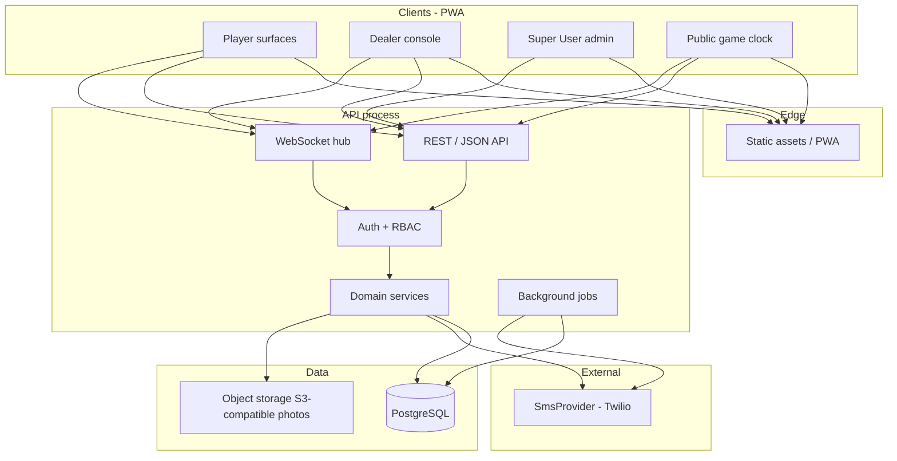
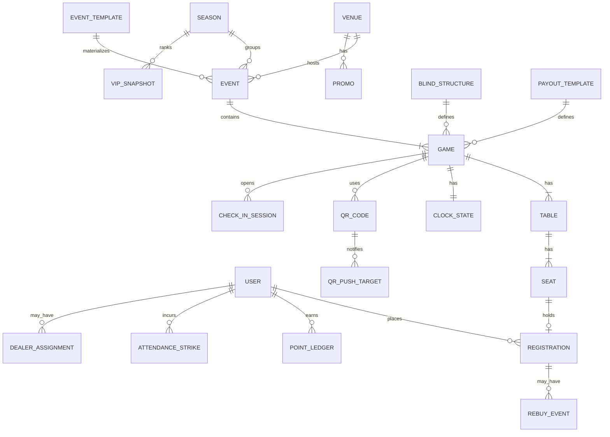
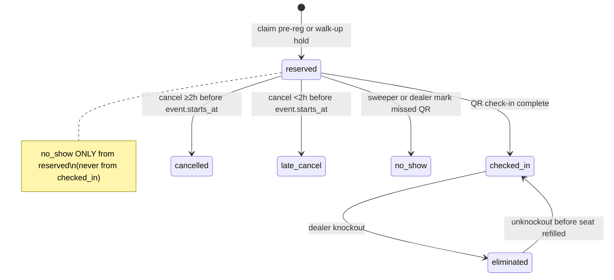
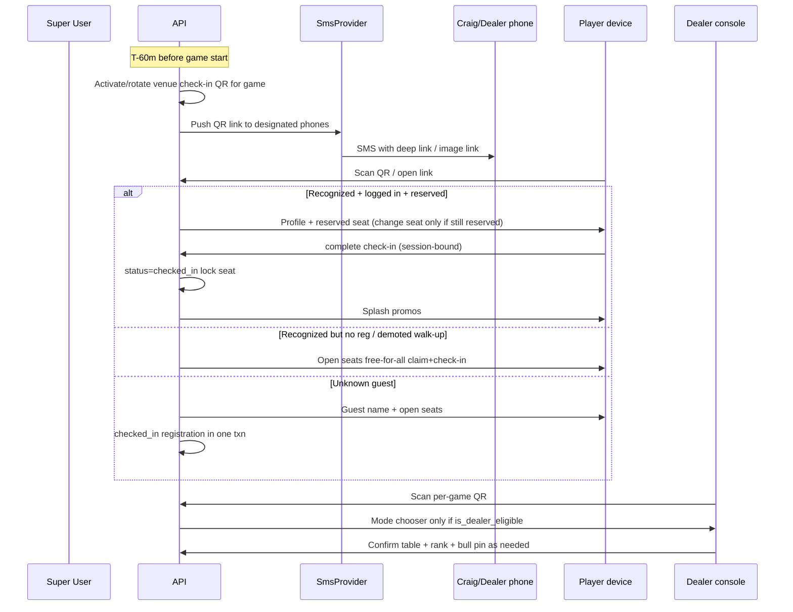
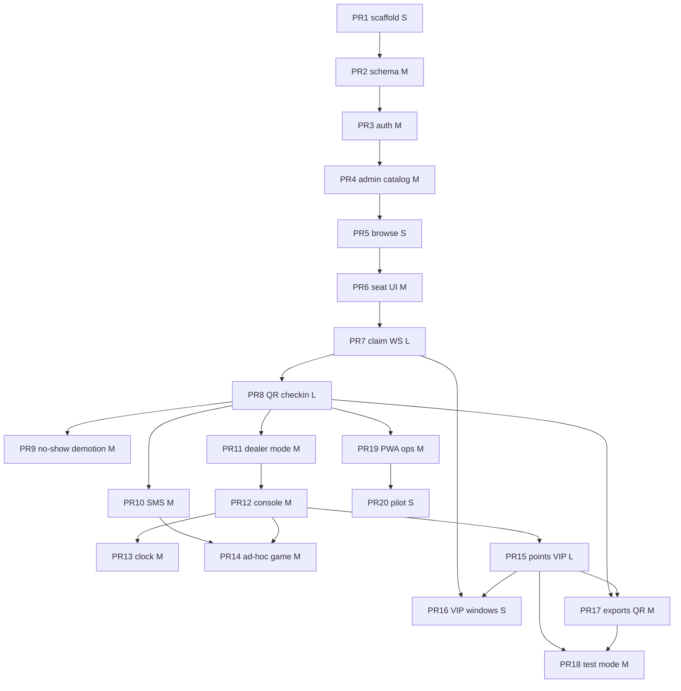

# The Poker Tour — Full Platform Design

| Field | Value |
|-------|--------|
| **Document title** | The Poker Tour — Full Platform Architecture & Product Design |
| **Author** | Engineering (design draft) |
| **Date** | 2026-07-16 |
| **Status** | Draft (post-review revision) |
| **Product name (UI)** | Organization title — default **The Poker Tour**; **Super User editable** at runtime (`organization.title`); demo prototype brand “Poker League” is not production copy |
| **Public base URL** | Config `APP_PUBLIC_BASE_URL` (e.g. `https://app.thepokertour.example`) |
| **Prototype seed** | `/Users/greghosman/poker-league/` (`index.html`, `app.js`, `styles.css`) |
| **Audience** | Engineers implementing v1; product for scope alignment |

---

## Overview

**The Poker Tour** is a mobile-first web platform for a single local poker circuit: multi-venue event scheduling, seat selection, QR check-in, dealer tools (knockouts, game clocks, table leveling), automated points/leaderboards, VIP early access, and SMS-driven operational notifications.

An existing client-only demo (`poker-league`) already prototypes the core **3-step signup UX** (profile → elliptical seat map across tables → confirmation) with `localStorage` persistence. This design treats that demo as a **UX seed**—seat-map layout, table tabs, selection bar, dark “felt” visual language—and proposes a real multi-role product that replaces hard-coded `EVENT` / local state with a backend, auth, real-time seat locks, QR flows, and operational tooling.

**Proposed solution (summary):** a pragmatic **Vite/React PWA + Fastify/TS API + Postgres** monorepo, capability-based authz (player / dealer-eligible / super_user), transactional confirm-only seat claims with WebSocket snapshots, provider-abstracted SMS (Twilio), **per-game** QR check-in sessions, automated points + VIP top-10, Super User CSV exports, and **Test Mode on a separate demo DB**.

---

## Background & Motivation

### Current state (prototype)

| Aspect | Demo behavior | Path / symbol |
|--------|---------------|---------------|
| Stack | Static HTML/CSS/JS, no build | `poker-league/` |
| Event | Hard-coded constant | `EVENT` in `app.js` |
| Layout | 4 tables × 9 seats | `TABLE_COUNT`, `SEATS_PER_TABLE` |
| Seats | In-memory map `"t-s" → { status, name?, email? }` | `state.seats`, `seatKey()` |
| Persistence | Browser only | `localStorage` key `poker-league-demo-v1` |
| Seed data | Fake taken seats | `SEED_TAKEN` |
| UX flow | Steps 1→2→3 with stepper | `setStep()`, panels in `index.html` |
| Seat UI | Ellipse around felt; tabs per table | `seatPosition()`, `renderTableStage()` |
| Concurrency | None (single browser) | N/A |
| Auth / roles / QR / points / dealers | None | README “Next ideas” |

### Pain points the product must solve

1. **Operational load on organizers** — seat lists, walk-ups, no-shows, and dealer assignment currently live outside software.
2. **No shared source of truth** — seats and registrations cannot coordinate across phones at the venue.
3. **No check-in integrity** — demo confirmation is not a locked, venue-validated seat.
4. **No dealer console** — knockouts, clocks, re-seats, and mid-event games are manual.
5. **No circuit identity** — points, VIP priority, seasons, and lifetime rankings need durable player accounts.
6. **SMS is part of ops** — QR push to Craig/dealers, knockout offers for next game, guest walk-up codes.

### Scale context (design for this, not more)

| Dimension | Estimate |
|-----------|----------|
| Players | Hundreds registered; dozens concurrent per venue night |
| Venues | ~7 |
| Concurrent live games | Low single digits typically; spike on busy nights |
| Peak seat claims | Bursts at VIP open / general open / walk-up |
| Real-time clients | Seat maps + clocks + dealer console: tens–low hundreds connections, not millions |

Over-engineering (multi-region, multi-tenant isolation, Kafka, microservices fleet) is explicitly out of scope for v1.

---

## Goals & Non-Goals

### Goals

1. Ship a **production PWA** for The Poker Tour: signup, seat map, QR check-in, splash promos.
2. Support **three roles** with hierarchical privileges: Player → Dealer → Super User.
3. **Configurable** seasons/series, venues, game rules (blinds, stacks, timing), payout % , signup windows.
4. **QR system** for check-in, walk-up/guest, dealer identification, Super User push list management.
5. **Reliability of seats**: concurrent-safe claim/release; cancel rules; no-show demotion.
6. **Points & leaderboards**: entry-scaled pools, Super User payout templates, series + lifetime VIP.
7. **Dealer Bull Pin** and on-site dealer/player mode switch; table assignment; mid-event game creation.
8. **Live public game clock** + **dealer game clock** with knockouts and **auto table balance**.
9. **SMS** for QR delivery, knockouts, new-game signup invites (provider abstraction).
10. **Test Mode** that seeds dealers, players (VIP), venues, events and exercises core flows.
11. **Backoffice** CSV exports and Super User admin surfaces.
12. Preserve demo **seat-map UX concepts** (table tabs, felt stage, open/taken/selected semantics).
13. Super User can set **organization title** (default “The Poker Tour”) so all UI/brand strings follow the live circuit name.

### Non-Goals (v1)

- Multi-tenant SaaS (other circuits as isolated customers) — single org unless product later expands.
- Native iOS/Android apps (PWA is default).
- Online cash games, payments, or real-money wallet features.
- Complex poker hand history / equity tools.
- ~~AI table balancing beyond alerts~~ — **superseded:** v1 includes **auto-balance** (deterministic algorithm below), not ML.
- Offline-first full play without network (PWA shell + limited offline view is OK; seat claims require network).
- SOC2-grade enterprise SSO (simple email/phone auth is enough).
- **High Roller** apply/approve/access — **removed from product** (out of scope).

---

## Key Decisions

| Decision | Choice | Rationale |
|----------|--------|-----------|
| **Tenancy** | Single organization row; default title **“The Poker Tour”** | Matches owner scope; simpler auth, data model, and ops. |
| **Organization title** | Super User can **edit organization title** (display name across PWA header, emails/SMS templates, splash, admin). Stored in DB (`organization.title`), not hard-coded in client. Default seed: `The Poker Tour`. | Product requirement: circuit branding is Super User–owned. |
| **Client** | Mobile-first **PWA: Vite + React + TypeScript** (`vite-plugin-pwa`) | Locked for PR1; one codebase; installable; camera QR; reuses demo visual language. Vue rejected for v1 to avoid fork thrash. |
| **API** | **Node.js (TypeScript) + Fastify** | Schema validation, plugin model, first-class WS; Express not used. |
| **DB** | **PostgreSQL** + **Drizzle ORM** (migrations via drizzle-kit) | Relational integrity for seats/points; typed queries; greenfield. |
| **Realtime** | Native **WebSockets** on the API process (`@fastify/websocket` or `ws`) rooms per `gameId` | Seat maps and clocks need push; single process until multi-instance. |
| **Auth** | Phone OTP (primary) + email OTP; **HTTP-only Secure session cookies** (`@fastify/cookie` + server session store in Postgres) | Same-site PWA + API on shared parent domain (or reverse-proxy same origin). **CSRF:** SameSite=`Lax` + custom header `X-Requested-With` required on mutating requests from browser; no JWT access tokens in localStorage. |
| **Jobs** | **In-process `node-cron`** (or Fastify schedule plugin) for v1 | One API instance; move to pg-boss/BullMQ only when multi-instance. |
| **Object storage** | **S3-compatible** (Cloudflare R2 or MinIO in dev) for player photos | Signed GET URLs; no local disk in prod. |
| **Redis** | **None in v1** | Add only when horizontal scale or distributed rate limits require it. Sessions/rate limits live in Postgres. |
| **SMS** | `SmsProvider` interface; **Twilio** first impl; `ConsoleSmsProvider` in demo/test | Required product feature; swap without rewriting domain. |
| **QR payload** | Opaque `publicId` → server `qr_codes` row (token hash); **scoped per game** | Avoid PII; Super User regenerate invalidates prior `publicId`; T−60m activation. |
| **Seat model** | Server-authoritative; **confirm-only claims** (no soft-hold TTL); client updates only after HTTP 2xx | Matches demo `confirmSeat`; avoids abandoned soft holds. |
| **VIP rule** | **Hard top 10** Lifetime (+2h) and Series (+1h) as SoR. Dual membership → **max early window** (Lifetime wins: +2h). Percentage mode **out of v1**. Ties: higher prior lifetime points, then earlier `user.created_at`, then `user_id`. | Operable; product “limited to 10”. |
| **No-show demotion** | **3** account-level **no_shows** (missed QR check-in) → `waitlist_on_arrival`. **SoR:** uncleared `attendance_strikes` (`type=no_show`); `users.no_show_count` / `signup_priority` are **derived** in the same transaction as strike insert/clear. Late cancel logged only. | Product-confirmed; single write path prevents drift. |
| **Clock** | **One `clock_state` row per `game_id`** (shared blind clock). Dealer table UI is separate from level control. | Multi-table tournaments share levels; public `/clock/:gameId` is unambiguous. |
| **Points** | `points_pool = P × (paid_entries + rebuy_count)`; default P=10; rebuys recorded on registration | Matches product math; see Points section for entry definition. |
| **Waitlist-on-arrival** | **Free-for-all** open seats at on-site check-in (no ordered queue in v1) | Simpler ops; ordered queue deferred. |
| **Test Mode** | **Separate demo environment/DB** for stakeholder demos (default). Production may use `is_demo_data` **only if** all public queries use a mandatory scope helper + CI assertion—prefer separate DB. SMS forced to console when demo. | Avoids leaderboard/SMS pollution. |
| **Monorepo** | `apps/web`, `apps/api`, `packages/shared` | Shared types; one PR stream. |
| **Host** | Single VPS or small PaaS (Railway/Fly/Render) + managed Postgres | Matches scale and one-dev ops. |
| **UX continuity** | Port seat ellipse + table tabs + selection bar from demo | Players already understand the interaction. |
| **High Roller** | **Removed / out of scope** | Product owner final decision. |
| **Table leveling** | **Auto-balance** when table sizes differ by **> 1** active player (`checked_in`, not eliminated). Triggers: (1) post-knockout imbalance, (2) dealer/SU **Balance tables**. Prefer move fullest → shortest; avoid recently moved; short undo window. Manual `move-player` override always available. | Product final; safer than mid-hand silent moves without trigger. |
| **Ad-hoc game payouts** | Series/template **defaults** on create; **dealer may override payout %** for that ad-hoc game; Super User may always override. | Product final. |
| **Player photo** | **Required** for registered players before check-in `complete`. Guests/walk-up without account: exempt (optional). | Product final. |

---

## Proposed Design

### High-level architecture



**v1 simplification:** API + WebSocket + `node-cron` jobs in **one Node process**. **No Redis in v1** (sessions/rate limits in Postgres). Redis only if/when multi-instance later — not drawn in v1 architecture.

### Role hierarchy & authz

**Canonical storage**

| Field | Values | Meaning |
|-------|--------|---------|
| `users.role` | `player` \| `super_user` | Only two durable roles. Super User implies all capabilities. |
| `users.is_dealer_eligible` | boolean | Super User grants; required for dealer mode / console (in addition to Super User). |
| On-site `dealer_assignments.mode` | `dealer` \| `player` | Per-game choice after QR; not a global role. |

Do **not** store `role=dealer`. Capability checks:

```ts
const isSuper = user.role === "super_user";
const canDealerConsole = isSuper || (user.is_dealer_eligible && assignment?.mode === "dealer");
const canAdmin = isSuper;
```

| Capability | Guest | Player | Dealer-eligible + mode=dealer | Super User |
|------------|:-----:|:------:|:-----------------------------:|:----------:|
| Browse venues / public clocks / leaderboards | ✓* | ✓ | ✓ | ✓ |
| Account profile edit | | ✓ | ✓ | ✓ |
| Pre-register + seat select (when eligible) | | ✓† | ✓† | ✓ |
| QR check-in as player | ✓ | ✓ | ✓ | ✓ |
| Dealer console, knockouts | | | ✓ | ✓ |
| Shared game clock control | | | ✓‡ | ✓ |
| Bull Pin table assignment | | | ✓ | ✓ |
| Create mid-event game | | | ✓ | ✓ |
| Admin / CSV / Test Mode / grant dealer / push phones | | | | ✓ |
| Edit **organization title** | | | | ✓ |

\*Guest: only via QR walk-up path.  
†Blocked for pre-reserve if `signup_priority = waitlist_on_arrival`.  
‡Any assigned dealer or SU may control the **shared** game clock; use optimistic `clock_state.version` (last-write wins with audit).

**Middleware matrix (server, never client-trusted)**

| Route group | Guard |
|-------------|--------|
| `/admin/*` | `role === super_user` |
| `/dealer/*` | Super User **or** (`is_dealer_eligible` + active `dealer_assignments` with `mode=dealer` for that game, except `POST /dealer/mode` which only needs eligible + check-in session) |
| `/games/:id/seats/claim` | Authenticated player (or guest session for walk-up complete path only) |
| Clock control POST | Same as dealer console |
| Exports | Super User + audit log |

**Bull Pin:** **per-user** hashed PIN set by Super User on dealer-eligible users (not a shared venue PIN). Rate-limit: 5 fails → 15 min lockout; audit failures.

**Mode switch mid-game:** `POST /dealer/mode` with `mode=player` clears `dealer_assignments.table_id` after confirm dialog; does not affect the player's registration if they are also playing.

Super User UI also exposes Dealer and Player surfaces (product requirement).

### Domain model (core entities)



#### Active registration statuses (critical)

```ts
const ACTIVE_SEAT_STATUSES = ["reserved", "checked_in"] as const;
// Hold seat_id uniqueness. Excluded: waitlist, eliminated, no_show, cancelled, late_cancel
```

Partial unique indexes:
- One active reg per `seat_id` where `status IN ('reserved','checked_in')`
- One active reg per `(game_id, user_id)` where `user_id IS NOT NULL` and status in active set

**Knockouts** use `registrations.status = eliminated` (no separate `eliminations` table). Optional `eliminated_at`, `elimination_order` columns on registration.

#### Core tables (logical)

**users**
- `id`, `display_name`, `email` (unique nullable until set), `phone_e164` (unique nullable)
- `photo_url` nullable; **required non-null before registered-player check-in `complete`** (guests without `user_id` exempt)
- `role`: `player | super_user`
- `is_dealer_eligible` boolean, `bull_pin_hash` nullable
- `lifetime_points` (cached from ledger)
- `no_show_count` **derived cache** (must equal count of uncleared `attendance_strikes` where `type=no_show`)
- `signup_priority`: `normal | waitlist_on_arrival` **derived** when `no_show_count >= 3`
- `sms_opt_out` boolean default false
- `created_at`, `status`: `active | suspended`
- `is_demo_data` boolean default false (only if demo rows ever share a DB)

**sessions**
- Server-side: `id`, `user_id`, `token_hash`, `expires_at`, `created_at`

**venues**
- `id`, `name`, `address`, `timezone`, `active`, `is_demo_data`

**seasons**
- `id`, `name`, `starts_at`, `ends_at`, `rules_json`, VIP offsets (`lifetime_early_minutes` default 120, `series_early_minutes` default 60)

**event_templates** (recurrence)
- `id`, `venue_id`, `rrule` or weekday+time, default game rules refs, `signup_offsets`, `active`

**events**
- `id`, `venue_id`, `season_id`, `template_id` nullable, `name`, `starts_at`
- `signup_opens_at`, `signup_closes_at` (general window)
- `cancel_deadline_offset_min` default **120** (relative to **`event.starts_at`** — product)
- `status`: `draft | published | live | completed | cancelled`
- `is_demo_data`

**games**
- `id`, `event_id`, `name`, `status`: `scheduled | open_signup | checkin | running | final | cancelled`
- `starts_at` (may equal event or later for multi-game nights / ad-hoc next games)
- **Check-in / no-show window (game-scoped defaults — not event-scoped):**
  - `checkin_opens_at` default = **`game.starts_at - 60m`**
  - `checkin_closes_at` default = **`coalesce(game.starts_at, event.starts_at) + no_show_grace_min`** (grace default **15** minutes)
  - Super User may override per game for ops tweaks; **not required** to make multi-game or ad-hoc games work
  - **Ad-hoc mid-event create:** must set `starts_at`, `checkin_opens_at`, `checkin_closes_at` explicitly from the **new game’s** start (never inherit a past `event.starts_at + 15m` as the only close time)
- Cancel deadline remains on **`event.starts_at`** (product); check-in close / no-show trigger is **per game**
- `starting_stack`, `blind_structure_id`, `level_minutes` override nullable, `rebuys_allowed`, `points_per_entry` default 10
- `payout_template_id`, `table_count`, `seats_per_table` (default 9; max 10)
- `created_by`, `is_demo_data`

**blind_structures** / **payout_templates**
- Named Super User configs; games reference by id (or embed snapshot JSON at game create for immutability)

**tables / seats**
- `tables`: `id`, `game_id`, `table_number`, `rank_label`, unique `(game_id, table_number)`
- `seats`: `id`, `table_id`, `seat_number`, unique `(table_id, seat_number)`

**registrations**
- `id`, `game_id`, `user_id` nullable, `guest_label`, `guest_phone_e164` nullable
- `seat_id` nullable, `status` as above, `source`: `pre_reg | walk_up | dealer_added`
- `checked_in_at`, `cancelled_at`, `eliminated_at`, `elimination_order` nullable
- `priority_class`: `lifetime_vip | series_vip | general | waitlist_arrival`
- `rebuy_count` int default 0
- `is_demo_data`

**rebuy_events**
- `id`, `registration_id`, `recorded_by`, `created_at` (each rebuy increments `registrations.rebuy_count`)

**qr_codes**
- `id`, `game_id` (**per-game scope**), `public_id` unique, `token_hash`
- `type`: `checkin` (player + walk-up + dealer entry via same code family)
- `active_from`, `active_until`, `revoked_at`, `pushed_at` nullable

**check_in_sessions**
- `id`, `qr_code_id`, `game_id`, `user_id` nullable, `guest_session_token` nullable
- `started_at`, `completed_at`, `expires_at` (short TTL e.g. 15 min)
- Bound to authenticated user **or** opaque guest session cookie at `start`; `complete` requires same binding

**qr_push_targets**
- `id`, `label`, `phone_e164`, `venue_id` nullable, `include_all_dealers` bool, `active`

**clock_state** (**exactly one row per game**)
- `game_id` PK/unique, `level_index`, `level_started_at`, `paused_ms`, `status`: `idle | running | paused | stopped`
- `version` int for optimistic concurrency, `updated_by`

**dealer_assignments**
- `id`, `game_id`, `user_id`, `mode`: `dealer | player`, `table_id` nullable, `rank_label` nullable, `updated_at`
- Unique `(game_id, user_id)`

**point_ledger**
- `id`, `user_id`, `game_id`, `season_id`, `points`, `reason`: `placement | adjustment | test_seed`
- Unique `(user_id, game_id, reason)` for placement idempotency

**vip_snapshots**
- `id`, `season_id` nullable (null = lifetime), `as_of`, `user_id`, `rank`, `points`
- Refreshed on game finalize + nightly reconcile

**attendance_strikes** — **demotion SoR**
- `user_id`, `game_id`, `type`: `no_show | late_cancel`, `season_id` nullable (reporting only)
- `created_at`, `cleared_at` nullable
- Unique `(user_id, game_id, type)` for idempotency
- Auto-demotion uses count of rows where `type=no_show AND cleared_at IS NULL` ≥ **3**
- On insert/clear of no_show: same txn updates `users.no_show_count` and `signup_priority`

**promos**
- `id`, `venue_id` and/or `event_id`, `title`, `body`, `active_from`, `active_until`

**sms_log**
- `id`, `to_e164`, `template_key`, `provider_message_id`, `status`, `idempotency_key`, `error`, `created_at`

**organization** (single-row table for single-org product)
- `id` (fixed singleton, e.g. `1`)
- `title` — display name shown in PWA chrome, login, emails/SMS template vars (`{{org_title}}`), splash, admin; **default seed `The Poker Tour`**
- `updated_at`, `updated_by_user_id`
- Super User only may `PATCH` title (validation: 1–80 chars, trimmed, no HTML)
- Public read: `GET /public/organization` → `{ title }` (cached short TTL client-side; refresh on app load)

**app_config / feature_flags**
- Key/value: VIP offsets, `cancel_deadline_offset_min=120`, `no_show_demotion_threshold=3`, `demotion_strike_types=["no_show"]`, `no_show_grace_min=15`, `sms_enabled`, `vip_windows_enabled`, `walk_up_guest_enabled`, `support_email`
- **`APP_PUBLIC_BASE_URL`** remains deploy/env config (QR link host), not Super User title
- Organization display name is **`organization.title`**, not a hard-coded env `APP_PUBLIC_NAME` (env may seed the row on first boot only)

### Seat lifecycle (from demo → production)

| Demo | Production |
|------|------------|
| Step 1 profile form | Authenticated profile (or guest capture on walk-up) |
| Step 2 seat map | Live seat map for `gameId` with priority windows |
| Step 3 confirmation | `reserved` registration (**confirm-only**, no soft-hold) |
| `confirmSeat()` + `releasePlayerSeatIfAny` | Atomic claim / change-seat transaction |
| QR (missing) | `reserved` → `checked_in` **locks** seat for player self-service |

#### Registration status machine (not account priority)



**Account priority** (`signup_priority`) is separate: demotion does **not** transition a hold to `waitlist` status. Demoted players simply fail pre-reg eligibility (`canPreReserveSeat=false`) and use on-site free-for-all claim+check-in.

**Full field:** optional registration with `status=waitlist`, `seat_id=null` (v1 may skip formal waitlist queue—open seats only).

#### Post-check-in lock matrix (state × actor)

| Action | Player (own reg) | Dealer / SU | System |
|--------|------------------|-------------|--------|
| Change seat while `reserved` | ✓ (atomic re-seat) | ✓ | |
| Cancel / leave while `reserved` | ✓ (cancel API) | ✓ | |
| Change seat after `checked_in` | ✗ | ✓ `move-player` | |
| Self-release after `checked_in` | ✗ | ✓ (admin cancel rare) | |
| Knockout → `eliminated` | ✗ | ✓ | |
| Unknockout | ✗ | ✓ until seat refilled / new occupant | |
| Clear `seat_id` on eliminate | — | **Null `seat_id` on knockout** (v1 default) so open-seat uniqueness/claim is simple; unknockout reassigns only if seat still free | |
| Mark `no_show` | ✗ | ✓ from `reserved` only | Sweeper from `reserved` only |
| Complete check-in without photo (registered user) | ✗ must upload first | may assist upload | |
| Walk-up guest (no account) | claim+check-in; photo optional | may assist | |
| Auto-balance move | ✗ | ✓ trigger / undo / override | System on knockout imbalance or Balance |

**Walk-up API:** single `POST /checkin/complete` may create registration `checked_in` with seat in **one transaction** (no intermediate client-visible `reserved` required). Pre-reg path is two-step: claim → later check-in.

**Eliminated seat cleanup:** On knockout, set `status=eliminated` and **`seat_id = NULL`** in the same transaction (frees the seat for waitlist/walk-up/balance). If an older eliminated row somehow still references a seat, any successful claim/move onto that seat also nulls that eliminated reg’s `seat_id` in the same transaction. Unknockout requires an open seat (or original seat if still free).

#### Claim algorithm (single transaction)

```text
BEGIN;
  -- 1. Lock target seat row
  SELECT * FROM seats WHERE id = $seatId FOR UPDATE;
  -- 2. Lock user row if authenticated (serialize multi-seat double-claim)
  SELECT * FROM users WHERE id = $userId FOR UPDATE;  -- skip for pure guest complete

  -- 3. Load game + event; validate game.status IN ('open_signup','checkin')
  --    for pre-reg claim; walk-up complete also allows 'running' if Super User config allows late entry
  -- 4. Eligibility:
  --    - if signup_priority = waitlist_on_arrival AND source path = pre_reg → 403 DEMOTION_WAITLIST_ONLY
  --    - if now < effective_open_for_user → 403 WINDOW_CLOSED
  --    - VIP open = max(lifetime_window, series_window) from vip_snapshots / ranks
  -- 5. Existing registration for this user+game (player claim path):
  --    - none → proceed to assign
  --    - status === 'reserved':
  --        same seat → noop success
  --        different seat → atomic re-seat (null old seat_id / update to new) — mirrors demo releasePlayerSeatIfAny
  --    - status === 'checked_in' AND actor is player → 403 SEAT_LOCKED
  --      (only dealer/SU move-player may reassign checked_in players)
  --    - status === 'checked_in' AND actor is dealer/SU → use move-player path, not player claim
  -- 6. Ensure no ACTIVE (reserved|checked_in) reg on target seat → else 409 SEAT_TAKEN
  --    Also: UPDATE registrations SET seat_id=NULL WHERE seat_id=$seatId AND status='eliminated'
  --    (defensive if any historical eliminated row still points at seat)
  -- 7. INSERT or UPDATE registration status=reserved (or checked_in if walk-up complete)
  -- 8. COMMIT; publish WS seat.snapshot|updated with version++
```

**Error codes:** `409 SEAT_TAKEN`, `403 WINDOW_CLOSED`, `403 DEMOTION_WAITLIST_ONLY`, `403 SEAT_LOCKED` (player tried to change seat after check-in), `409 ALREADY_REGISTERED` (active reg conflict when not change-seat), `409 GAME_NOT_OPEN`, `401 UNAUTHORIZED`.

**API note:** Player `POST .../seats/claim` is change-seat only while `reserved`. Dealer re-seat after check-in is exclusively `POST /dealer/games/:id/move-player`.

### Signup windows & VIP priority

| Cohort | Early access before general `signup_opens_at` |
|--------|-----------------------------------------------|
| Lifetime VIP (Top 10 lifetime) | **+2 hours** |
| Series VIP (Top 10 series) | **+1 hour** |
| Both lists | **max window → +2 hours** (Lifetime wins) |
| General | `event.signup_opens_at` |
| Waitlist-on-arrival | **No pre-reserve**; on-site free-for-all open seats only |

**SoR ranks:** hard top 10 via `vip_snapshots` (and `lifetime_points` until first snapshot). Percentage mode **out of v1**.

**Ties for rank 10:** higher points → earlier `users.created_at` → lower `user_id`.

**Refresh:** on each game finalize + nightly job. Until points engine exists, Super User may seed snapshot rows / lifetime_points for VIP testing.

### Cancel / no-show policy

**Product-confirmed (final).**

| Action | Definition / timing | Effect |
|--------|---------------------|--------|
| **Cancel (on time)** | ≥ **2 hours** before **`event.starts_at`** | Status `cancelled`; free `seat_id`; no strike |
| **Late cancel** | &lt; **2 hours** before **`event.starts_at`** | Status `late_cancel`; free seat; insert `attendance_strikes` type `late_cancel` (reporting only; **not** demotion) |
| **No-show** | `reserved` reg never completed **QR check-in** for **that `game_id`** | Status `no_show`; free seat; insert uncleared strike `no_show`; recompute derived user fields in same txn |
| **Demotion** | ≥ **3** uncleared `no_show` strikes (account-level) | `signup_priority = waitlist_on_arrival` |

**Multi-game nights:**  
- **Cancel deadline** always uses parent **`event.starts_at`** (product: Craig manages event size).  
- **No-show / check-in close** evaluated **per `game_id`** when that game’s **`checkin_closes_at`** passes, defaulting to **`game.starts_at + no_show_grace_min`** (not `event.starts_at + grace`). Game 2 later the same night and mid-event ad-hoc games therefore sweep on **their own** start+grace, not the first game’s door time.

**SoR:** `attendance_strikes` authoritative; `users.no_show_count` / `signup_priority` written in the same transaction as strike insert or clear—never updated alone.

**Clear demotion** (`POST /admin/users/:id/clear-demotion`): set `cleared_at=now()` on all uncleared `no_show` strikes for user; set `no_show_count=0`, `signup_priority=normal`; **immediately** re-allows pre-reg. Audit log required.

**No-show sweeper contract**

- Cadence: every **1–5 min**.
- Select games where `now >= checkin_closes_at` and status not `cancelled`.
- For each:  
  `UPDATE registrations SET status='no_show', seat_id=NULL WHERE game_id=$g AND status='reserved' RETURNING *`  
  (CAS: only `reserved` rows; concurrent check-in that already set `checked_in` is unaffected).
- For each returned row with `user_id`: upsert strike `(user_id, game_id, 'no_show')` if not exists; recompute user demotion fields.
- Dealer may also mark no-show early (same path) to free seats for walk-ups before grace ends.
- Idempotent: unique strike constraint + status CAS.

### QR system



**QR types & lifecycle**

1. **Per-game check-in QR** (primary) — one active code per `game_id`; activates at `checkin_opens_at` (~T−60m); SMS push once (`pushed_at`).
2. **Regenerate** — Super User/dealer mints new `public_id`; prior id → `revoked_at`; old links return **410**.
3. **Ad-hoc next game** — new game row + new QR; SMS to eliminated players + dealer.

**Resolve `GET /c/:publicId` (public, minimal DTO — no roster/PII):**

```ts
{ gameId, venueName, gameName, startsAt, state: "active"|"expired"|"revoked",
  requiresAuth: boolean }
```

Outside `active_from`/`active_until` or revoked → **410** “See staff for current code.”

**Session binding:** `POST /checkin/sessions/start` creates `check_in_sessions` bound to session user or guest cookie; `complete` requires same session id + unexpired row. Prevents replaying complete with another party’s token alone.

**Dealer elevation:** Mode chooser only if `is_dealer_eligible` **and** (optional) user is in venue dealer allow-list / assigned for event. Scanning QR never elevates random players.

**Push recipients:** `qr_push_targets` + dealers for venue; Super User managed.

### Player journeys

#### Pre-registered player

1. Venue → game → eligibility.  
2. If `canPreReserveSeat`, open seat map → claim → confirmation.  
3. Arrive; scan QR → (optional change seat while still `reserved`) → if registered and no `photo_url`, **forced photo upload** → complete check-in → **lock** → splash.  
4. KO → SMS next-game options.

#### Walk-up / late / demoted

1. Scan per-game QR → login or guest name (+ optional phone).  
2. **Open seats only** = no active holder (`reserved`/`checked_in`). Absentee seats free after sweeper **or** dealer “release no-shows early.”  
3. Demoted users: may browse public info; seat map claim for pre-reg rejected; on-site path allows claim+check-in free-for-all.  
4. `complete` transaction: seat + `checked_in`.

#### Guest → account merge

- Guest reg stores optional `guest_phone_e164`.  
- Later: user verifies OTP on that phone → `POST /registrations/:id/claim` attaches `user_id` if phone matches and user has **no** other active reg for that game; else **409**.  
- **Retention:** guest rows without account kept **90 days**, then anonymize labels/phones (default; legal override via open process if needed).

#### Splash page (post check-in)

Venue specials/coupons/promos; seat summary; link to public clock.

### Dealer Bull Pin & console

1. Super User sets `is_dealer_eligible` + **per-user Bull Pin**.  
2. QR → mode select (eligible only) → table + rank.  
3. Console: table graphic with photos/guest labels; knockout/undo; **auto-balance** + manual move-player; **shared** clock controls; finalize placements; mid-event game create (with optional **payout % override**); regenerate QR.

Table break = registration/elimination state, not a separate clock.

### Table auto-balance (product final)

**Goal:** Keep live tables within **1 player** of each other for counts of active in-play registrations (`status = checked_in` only; `eliminated` already free seats).

**Imbalance definition:**  
Let \(n_t\) = count of `checked_in` players at table \(t\). Imbalanced when \(\max n_t - \min n_t > 1\).

**Triggers (v1 — safe defaults):**

1. **After knockout** that leaves imbalance (server evaluates after each successful knockout).  
2. **Dealer/SU** `POST /dealer/games/:id/balance-tables` (“Balance tables” button).  
3. Not continuous mid-hand without a trigger. Preferred operational practice: pause clock or run between hands; system does **not** require pause but UI warns “Balance between hands when possible.”

**Algorithm (deterministic):**

```text
while max(n) - min(n) > 1:
  from = fullest table (tie: lowest table_number)
  to   = shortest table (tie: lowest table_number)
  pick mover from `from` among checked_in:
    prefer never moved this game; else oldest last_moved_at;
    tie: lowest seat_number
  assign mover to first open seat_number on `to`
  record balance_move (registration_id, from_seat, to_seat, reason)
  set registration.last_moved_at = now()
```

**Transaction:** lock game seats / affected regs; update `seat_id` / table; commit; WS `seat.snapshot` + `table.balanced` (includes move list). Notify dealers on both tables via dealer console toast; optional in-app notice to moved player (SMS not required for balance moves in v1).

**Undo:** last balance batch undoable for **60 seconds** (`POST .../balance-tables/undo`) if no conflicting manual move since; then locked.

**Overrides:** Super User / dealer `move-player` always allowed; cancels pending undo for conflicting seats.

**Risks:** mid-hand chip stacks are physical — dealers own timing of when to hit Balance / accept post-knockout auto moves. Audit all auto moves.

### Ad-hoc mid-event games — payout % (product final)

On `POST /dealer/games` (ad-hoc):

1. Copy series/event **payout template** defaults onto the new game (`payout_percentages` snapshot).  
2. Dealer **may edit** percentages for that game before/while signup opens (must sum to 100).  
3. Super User may edit anytime.  
4. Scheduled (non-ad-hoc) games: dealer cannot change payout % unless Super User grants (v1: **SU only** for non-ad-hoc).

### Points & ranking

**Definitions (v1 defaults — closes rebuy ambiguity)**

| Term | Definition |
|------|------------|
| `paid_entries` | Count of registrations in `{checked_in, eliminated}` at finalize (**exclude** `no_show`, `cancelled`, `late_cancel`, pure never-checked-in). `reserved` at finalize should already be swept to no_show. |
| `rebuy_count` | `SUM(registrations.rebuy_count)` (each `rebuy_events` row increments) |
| Pool | \(P \times (\text{paid\_entries} + \text{total rebuys})\), default \(P=10\) |
| Rebuy effect | Adds to pool only; does **not** create extra payout ranks; placement still one per player |
| Guests | **Must** attach `user_id` (claim account) before points award; unclaimed guests get **0** ledger rows and dealer prompt on finalize |

**Finalize input:** ordered `placements: [{ userId, place }]` for places that earn % (top N from template). Remainder of field: 0 points. Validate unique places; idempotent ledger unique `(user_id, game_id, 'placement')`.

**Distribution:** Super User (and dealer on **ad-hoc** games only) % list sums to 100. Multi-table e.g. 50/30/20; single-table default 100% to 1st. Stored per game as snapshot JSON.

**API:**  
- `POST /dealer/games/:id/rebuys { registrationId }`  
- `PATCH /dealer/games/:id/payouts { percentages: number[] }` — **ad-hoc games only** (dealer); SU any game  
- `POST /dealer/games/:id/balance-tables` / `.../undo`

**Leaderboards / VIP:** season + lifetime; top 10 snapshots after finalize.

### Live game clock

**One shared clock per `game_id`** (SoR: single `clock_state` row).

**Public (view-only):** venue/game, current/next blinds, next break, players remaining; reads same row.

**Dealer controls:** start/stop/pause/next level — any dealer on game or SU; optimistic `version` on write; audit `updated_by`. Dealer **table** UI is per assignment; clock is not per-table.

Clients compute countdown from server timestamps; WS `clock.updated` on changes (no tick stream required).

### SMS design

```ts
interface SmsProvider {
  send(input: {
    toE164: string;
    body: string;
    idempotencyKey?: string;
  }): Promise<{ providerMessageId: string }>;
}
```

**Templates (examples):**

| Key | When |
|-----|------|
| `qr.push` | T−60m to push list |
| `knockout.next_game` | Player eliminated; next game available |
| `new_game.signup` | Mid-event game created |
| `registration.reminder` | Optional T−24h / T−2h |

All sends logged; respect STOP/compliance; rate limits per user.

### Test Mode (first-class)

| Seed | Count / notes |
|------|----------------|
| Dealers | 4 (`is_dealer_eligible`) |
| Players | 100 random points; 10 Series VIP + 10 Lifetime VIP via snapshots |
| Venues | 7; each with 3 upcoming events |
| Functions | Signup, claim, QR, knockouts, clocks, points, SMS console |

**v1 isolation (decided):** run stakeholder demos on a **separate demo environment / database** (`DATABASE_URL` demo). Production DB is not seeded with demo players by default.

If a single DB is ever used: every public stats/VIP/leaderboard query **must** go through `excludeDemo()` helper; CI test asserts no `is_demo_data=true` rows in those responses. SMS: if `is_demo_data` context or `sms_enabled=false` or `NODE_ENV` demo → **only** `ConsoleSmsProvider`.

**Reset:** transactional delete of all demo-tagged rows in FK-safe order (or drop/recreate demo DB). Banner when `APP_ENV=demo`.

### Frontend information architecture

```
/                         Home / venue picker
/venues/:id               Venue schedule
/games/:id                Game detail + signup CTA
/games/:id/seats          Seat map (demo UX port)
/games/:id/confirm        Confirmation
/c/:publicId              QR entry (check-in router)
/splash                   Post check-in promos
/me                       Profile (email, phone, photo)
/stats                    Leaderboards + VIP lists
/clock/:gameId            Public clock
/dealer                   Dealer home / mode
/dealer/games/:id         Dealer console + clock
/admin                    Super User dashboard
/admin/organization       Organization title (circuit name)
/admin/venues|seasons|events|games|rules
/admin/qr                 QR edit / regenerate / push phones
/admin/users              Roles, dealer flags, demotion clear
/admin/exports            CSV downloads
/admin/test               Test Mode
```

**Organization title UX (Super User)**

- Admin page **Organization** (or Settings → Organization): single field **Title**, save, audit.
- On save, client invalidates public org cache; all shells re-read `title` for brand/header.
- SMS/email templates use `{{org_title}}` from live `organization.title` at send time.

**UI reuse from demo**

- Design tokens from `styles.css` (`--bg`, `--felt`, `--accent`, `--gold`, seat classes).  
- `seatPosition(index, total)` ellipse algorithm.  
- Table tabs + open counts.  
- 3-step stepper for first-time signup; logged-in users may skip profile step.  
- Selection bar “Confirm seat”.

**Locked stack:** Vite + React + TypeScript, React Query, WS hook, `vite-plugin-pwa`; Fastify API; Drizzle + Postgres.

### Backend module map

```
apps/api/src/
  modules/ auth, users, venues, seasons, events, games, seats, checkin, qr,
           dealer, clock, points, vip, sms, admin, testmode
  realtime/
  jobs/   # QR T-60m, no-show sweeper, recurrence, VIP reconcile (node-cron)
  lib/    # rbac, excludeDemo, csrf header check
```

### Realtime protocol (implementable)

**Connect:** browser opens `wss://…/ws` with **session cookie** (same-origin) or `?session=` only for native-like edge cases—prefer cookie. Server rejects unauthenticated subscribe to private rooms.

**Handshake flow:**

1. Client connects → server validates session.  
2. Client: `{ type: "subscribe", room: "game:{gameId}" }`.  
3. Server authz: public seat fields for all; dealer-enriched labels only if `canDealerConsole`.  
4. Server immediately sends **`seat.snapshot`**: full `SeatMapDTO` + `version` (monotonic int per game).  
5. Mutations publish **`seat.updated`**: `{ version, patch }` or full snapshot if patch gap risk.  
6. Client on version gap / reconnect → REST `GET /games/:id/seats` and resubscribe.  
7. **Claim UI:** await HTTP 2xx then apply; on `409` refetch REST (do not rely on optimistic-only patches). Multi-tab: each tab holds WS; server state is SoR.

| Room | Events |
|------|--------|
| `game:{gameId}` | `seat.snapshot`, `seat.updated`, `clock.updated`, `game.status`, `table.balanced`, `table.uneven` |
| `venue:{venueId}` | `event.updated` |
| `user:{userId}` | optional personal notices |

### Recurring events

Super User defines template: weekday, time, venue, default rules, signup offsets. Job materializes next N occurrences as `events`/`games`. Edits to “upcoming or current” apply to instance; template edit affects future materializations only.

---

## API / Interface Changes

There is no production API yet; below is the **v1 surface**. All authenticated unless noted.

### Auth

```
POST /auth/otp/request     { phone | email }
POST /auth/otp/verify      { phone|email, code } → Set-Cookie session
POST /auth/logout
GET  /me
PATCH /me                  { displayName, email, phone, ... }
POST /me/photo             multipart
```

### Catalog & signup

```
GET  /venues
GET  /venues/:id/events
GET  /games/:id
GET  /games/:id/seats       → SeatMapDTO + version
POST /games/:id/seats/claim { seatId } | { tableNumber, seatNumber }
// change-seat = claim only while reg status is reserved (atomic); checked_in → 403 SEAT_LOCKED for players
// dealer re-seat after check-in: POST /dealer/games/:id/move-player only
POST /games/:id/registrations/cancel   // leave game (see cancel semantics)
GET  /games/:id/eligibility → {
  canSignup, canPreReserveSeat, windowOpensAt, priorityClass, reason,
  noShowCount, demotionThreshold
}
POST /registrations/:id/claim-account  // guest → user after OTP phone match
POST /admin/users/:id/clear-demotion
POST /admin/jobs/no-show-sweep         // manual run (runbook)
POST /admin/jobs/qr-push/:gameId       // resend push
```

**Cancel semantics (`POST .../registrations/cancel`):**

- Authz: owner or dealer/SU.  
- If `now <= event.starts_at - cancel_deadline_offset_min` → status `cancelled`, free seat, no strike.  
- Else → status `late_cancel`, free seat, insert `late_cancel` strike (not demotion).  
- Response: `{ status: "cancelled"|"late_cancel", strikeRecorded: boolean }`.  
- WS seat update.  
- **Not** the same as change-seat: leaving the game only. Internal seat free is part of claim/change-seat and cancel—no separate player `seats/release` for abandoning without cancel.

**SeatMapDTO** (demo `open|taken` + local `selected` → production):

```ts
// Public player view: demo "taken" = any non-open occupied seat
type SeatPublicStatus = "open" | "taken" | "mine";
// Dealer/SU view expands taken into reserved vs checked_in + labels
type SeatDealerStatus = "open" | "reserved" | "checked_in" | "eliminated_slot";

type SeatMapDTO = {
  gameId: string;
  version: number;          // monotonic; WS + REST
  tableCount: number;
  seatsPerTable: number;
  tables: Array<{
    tableNumber: number;
    seats: Array<{
      seatNumber: number;
      status: SeatPublicStatus | SeatDealerStatus;
      label?: string;         // first name or "Guest" (dealer/public policy)
      photoUrl?: string | null;
      isMine?: boolean;
    }>;
  }>;
  openCount: number;
  updatedAt: string;
};
```

Demo mapping: local `selected` is client-only until claim; `taken` ← `reserved|checked_in` for others; `mine` ← own active seat. **No `empty_guest_slot`** — guests are normal seats with label `"Guest"`.

### Check-in / QR

```
GET  /c/:publicId                    // minimal public DTO; 410 if expired/revoked
POST /checkin/sessions/start         { publicId } → sessionId (bound to auth/guest cookie)
POST /checkin/complete               { sessionId, seatId?, guestProfile? }
// complete for registered user requires users.photo_url set → else 409 PHOTO_REQUIRED
POST /me/photo                       // multipart; ≤2MB jpeg/png; then retry complete
POST /admin/qr                       // create/regenerate per game
POST /admin/qr/:id/push
GET  /admin/qr
PATCH /admin/qr-push-targets
```

### Dealer

```
POST /dealer/mode                 { gameId, mode: "dealer"|"player" }
POST /dealer/assign-table         { gameId, tableNumber, rankLabel, bullPin }
POST /dealer/games                { ...rules, payoutPercentages? }  // ad-hoc; defaults from template; dealer may override %
PATCH /dealer/games/:id/payouts   { percentages }  // ad-hoc dealer or any game SU
POST /dealer/games/:id/knockout   { registrationId }  // may trigger auto-balance
POST /dealer/games/:id/unknockout { registrationId }
POST /dealer/games/:id/move-player { registrationId, toSeatId }
POST /dealer/games/:id/balance-tables
POST /dealer/games/:id/balance-tables/undo
POST /dealer/games/:id/rebuys     { registrationId }
POST /dealer/games/:id/mark-no-show { registrationId }  // reserved only
POST /dealer/games/:id/finalize   { placements: [{ userId, place }] }
GET  /dealer/games/:id/console
```

### Clock

```
GET  /games/:id/clock
POST /dealer/games/:id/clock  { action, expectedVersion? }
```

### Points / stats

```
GET /stats/lifetime      // exclude demo
GET /stats/seasons/:id
GET /stats/vip
GET /me/points
```

### Admin

```
GET  /public/organization                // { title } — no auth
GET  /admin/organization                 // Super User; same + updated_at, updated_by
PATCH /admin/organization                // Super User; body: { title }; audit log
CRUD /admin/venues|seasons|events|games|blind-structures|payout-templates|promos|event-templates
POST /admin/users/:id/roles              // set role player|super_user
POST /admin/users/:id/dealer-eligible    { eligible, bullPin? }
POST /admin/users/:id/clear-demotion
POST /admin/exports/points|players|dealers   // stream CSV; audit; no retained file
POST /admin/test/seed | reset            // demo env only
```

### WebSocket

See Realtime protocol: `subscribe` → `seat.snapshot` / `seat.updated` / `clock.updated` with `version`.

---

## Data Model Changes

### Migration strategy

1. Greenfield schema migrations via **Drizzle ORM + drizzle-kit only** (no Prisma / node-pg-migrate in v1).  
2. No production data from demo (`localStorage` is disposable).  
3. Seed Super User via env `BOOTSTRAP_SUPERUSER_PHONE`.  
4. Optional one-time import CSV of existing player phones if organizers have a list.  
5. Test Mode seed is separate migration-safe script (demo DB).

### Indexes (critical)

- `seats (table_id, seat_number)` unique  
- `registrations (seat_id)` unique where `status IN ('reserved','checked_in')`  
- `registrations (game_id, user_id)` unique where active & user_id not null  
- `attendance_strikes (user_id, game_id, type)` unique  
- `point_ledger (user_id, game_id, reason)` unique for placement  
- `qr_codes (public_id)` unique; `clock_state (game_id)` unique  
- `games (event_id, status)`  

### Caching

- VIP snapshots + `lifetime_points` updated on finalize.  
- Seat map read-through DB; `version` column/counter per game for WS.

---

## Alternatives Considered

### 1. No-backend / Firebase-only realtime

**Rejected** — seat transactions, CSV admin, audit, and SMS orchestration are weaker than Postgres monolith.

### 2. Native apps (React Native / Flutter)

**Rejected for v1** — PWA + SMS links sufficient; store friction.

### 3. Multi-tenant SaaS from day one

**Rejected for v1** — single org.

### 4. Server-Sent Events instead of WebSockets

**Rejected as default** — WS standardized; SSE acceptable later for public clock only.

### 5. Monolith vs microservices

**Chosen:** modular monolith.

### 6. Soft-hold seat TTL vs confirm-only

| Approach | Pros | Cons |
|----------|------|------|
| Soft-hold (TTL) | Reduces double-tap races during browse | Abandoned holds block seats; more jobs |
| **Confirm-only (chosen)** | Matches demo `confirmSeat`; simpler | Race only at confirm (handled by txn + 409) |

### 7. Job runner: in-process cron vs BullMQ/pg-boss

| Approach | Pros | Cons |
|----------|------|------|
| **node-cron in API (v1)** | Zero infra; fine for one instance | Not multi-instance safe |
| Queue library | Horizontal jobs, retries | Ops cost before needed |

Move to pg-boss when second API instance is required.

### 8. SMS providers

Twilio first; abstraction allows MessageBird/vonage later. Console provider for demo.

### 9. Separate dealer tablet app vs same PWA

**Same PWA** with `/dealer` routes — one codebase; install to home screen on dealer phones/tablets.

---

## Security & Privacy Considerations

| Threat | Severity | Mitigation |
|--------|----------|------------|
| Seat theft / race claim | High | Seat + user row locks; active-status uniques; never trust client |
| QR replay / share | Medium | Time box; rotate; **session-bound** check-in; rate limit complete |
| Privilege escalation | High | Server RBAC matrix; `role` + `is_dealer_eligible` never from body |
| Bull Pin brute force | Medium | Per-user hash; 5 fails / 15 min lockout; audit |
| SMS spam / cost | Medium | Rate limits; SU mass push only; idempotency; honor `sms_opt_out` |
| PII on seat map | Medium | Public first name only; dealer sees more; QR resolve has no roster |
| Photo abuse | Low | **≤2 MB**, jpeg/png only; S3 signed GET |
| Guest merge abuse | Medium | OTP phone verify; 409 if conflict |
| Demo pollution | High | Separate demo DB default; `excludeDemo` if shared |
| Session hijack / CSRF | Medium | HTTP-only Secure cookies; SameSite=Lax; require `X-Requested-With` on mutations |
| OTP abuse | Medium | **6-digit**, **10 min TTL**, **5 attempts**/code, **3 sends/hour/phone**; lockout |
| Export leak | Medium | Super User only; **stream ephemeral CSV** (no retained file); audit row |
| Twilio webhooks | Low | Validate signature if inbound webhooks added |

**OTP defaults:** 6 digits, 10 min TTL, 5 verify attempts, 3 request/hour/phone (email same).

**SMS opt-out:** `users.sms_opt_out`; suppress all marketing/ops SMS except critical security if ever needed (v1: suppress all).

**Help email:** `support_email` config; mailto v1.

---

## Observability

| Area | Approach |
|------|----------|
| Logging | Structured JSON: `requestId`, `userId`, `gameId`, action |
| Metrics | Claim latency, WS connections, SMS success/fail, check-in rate, sweeper marks, 5xx |
| Alerts | SMS failure spike; job lag (QR push not sent by T−55m); API 5xx |
| Audit | Admin, role grants, clear demotion, points adjust, QR regenerate, exports |
| Product | Signup → claim → check-in funnel; no-show rate |

Health: `GET /health` (db ping).

### Ops runbook actions (PR hardening)

| Action | How |
|--------|-----|
| Resend QR push | `POST /admin/jobs/qr-push/:gameId` |
| Run no-show sweeper now | `POST /admin/jobs/no-show-sweep` |
| Clear demotion | `POST /admin/users/:id/clear-demotion` |
| Rotate QR | `POST /admin/qr` regenerate |
| Dealer mark no-show early | Console → free seat for walk-up |
| SMS dead-letter | `sms_log` status=failed; manual resend with new idempotency key |

---

## Rollout Plan

### Phases

1. **Foundation** — monorepo, schema, auth, admin catalog (PR1–4).  
2. **Player seats** — browse, seat map UI, claim/WS/cancel (PR5–7).  
3. **QR check-in** — sessions, guest, splash (PR8).  
4. **Attendance + SMS** — no-show sweeper/demotion, QR push (PR9–10).  
5. **Dealer + clock** — console, shared clock, ad-hoc games (PR11–14).  
6. **Points + VIP windows** — finalize, snapshots, early access (PR15–16).  
7. **Admin/Test** — exports, recurrence, demo env seed (PR17–18).  
8. **Harden + pilot** — PWA, runbooks, one-venue launch (PR19–20).

### Feature flags

- `sms_enabled`  
- `vip_windows_enabled`  
- `test_mode_ui`  
- `walk_up_guest_enabled`

### Rollback

- DB migrations forward-only with expandable columns; avoid destructive renames early.  
- Feature flags off disables SMS/jobs without redeploy.  
- Keep previous web deploy artifact for static rollback.  
- QR rotate if token leak.

### Launch ops

- Seed real venues/events.  
- Train Craig + dealers on QR + console.  
- Run Test Mode demo night before first live event.  
- Soft launch one venue → expand to ~7.

---

## Risks

| Risk | Severity | Mitigation |
|------|----------|------------|
| Concurrent seat storms at VIP open | Medium | DB constraints + friendly 409 + WS refresh; avoid over-optimistic client locks |
| SMS deliverability / cost | Medium | Sandbox in Test Mode; batch push; monitor spend |
| Incomplete no-show automation | Medium | Sweeper at `checkin_closes_at` + dealer early mark + status CAS |
| Dual demotion counters drift | Medium | Strikes SoR; derive user fields in same txn |
| VIP rule product conflict | Low | Hard top-10; dual VIP → max window |
| Scope creep (multi-tenant, payments) | High | Strict non-goals; PR plan gates |
| Single-dev bus factor | Medium | Modular monolith, docs, Test Mode for regression demos |
| Clock drift | Low | Server timestamps only |
| Guest → account merge mistakes | Medium | Phone OTP verify before merge |

---

## Open Questions

1. **~~Strike / demotion~~ — RESOLVED (product):** Free cancel ≥2h; no-show = missed QR; 3 account no-shows → waitlist-on-arrival; late cancel log only.  
2. **~~VIP top 10%~~ — RESOLVED (engineering default):** Hard top 10 only in v1; percentage mode out of scope. Product may re-open later.  
3. **~~Rebuys~~ — RESOLVED (v1 default):** Each rebuy adds \(P\) to pool; does not add payout slots; one placement per player.  
4. **~~Waitlist structure~~ — RESOLVED (v1):** Free-for-all open seats on-site; ordered queue out of scope.  
5. **~~Guest retention~~ — RESOLVED (default 90 days)** anonymize; legal can override.  
6. **~~Multi-game~~ — RESOLVED:** Independent games/seat maps; cancel deadline on `event.starts_at`; no-show per game.  
7. **~~Table leveling~~ — RESOLVED (product final):** **Auto-balance** when max−min active table size **> 1**; trigger on knockout imbalance or dealer **Balance tables**; fullest→shortest; avoid recent movers; 60s undo; manual move-player override.  
8. **~~Test Mode isolation~~ — RESOLVED:** Separate demo DB/env preferred.  
9. **Domain / SMS long-code:** Final production domain and SMS long-code registration still TBD (`APP_PUBLIC_BASE_URL`). **Organization title** is Super User editable (default “The Poker Tour”) — RESOLVED as product feature.  
10. **~~Photo~~ — RESOLVED (product final):** **Required** for registered players before check-in complete; guests/walk-up without account exempt (optional).  
11. **~~High Roller~~ — REMOVED from product.**  
12. **~~Dealer payout edits~~ — RESOLVED (product final):** Ad-hoc mid-event games get template defaults; **dealer may override payout %** for that game; Super User always can.  

---

## References

- Prototype: `/Users/greghosman/poker-league/`  
  - `app.js` — `EVENT`, `STORAGE_KEY`, `seatKey`, `seatPosition`, `confirmSeat`, `SEED_TAKEN`  
  - `index.html` — 3-step panels, table stage, selection bar  
  - `styles.css` — design tokens, seat states, felt stage  
  - `README.md` — local server notes, “next ideas”  
- Product requirements — this document’s source brief (roles, QR, points, VIP, Test Mode)  
- Prior art (conceptual): poker room clock apps, Eventbrite-style check-in, Toast/OpenTable walk-up patterns  

---

## Implementation notes for engineers

### Porting the seat map

1. Extract pure functions from demo:
   - `seatKey(table, seat)`
   - `seatPosition(index, total)` with `rx=38`, `ry=36`
2. Replace `state.seats` with React Query `useSeatMap(gameId)` + WS invalidation.  
3. `selectSeat` stays local highlight; `confirmSeat` becomes API claim.  
4. Keep accessibility: `aria-label` on seats, tab roles on table tabs.  
5. Mobile width `min(100%, 480px)` container pattern from `.app`.

### Job schedules

| Job | Cadence |
|-----|---------|
| Activate QR + SMS push | Every minute; `checkin_opens_at <= now` and `pushed_at IS NULL` |
| No-show sweeper | Every 1–5 min; `now >= checkin_closes_at`; CAS `reserved` → `no_show` |
| Recurrence materialize | Daily |
| VIP reconcile | On finalize (inline) + nightly |

### Latency targets (local circuit)

| Action | Target |
|--------|--------|
| Seat claim p95 | &lt; 300 ms server |
| Seat map WS update | &lt; 500 ms to other clients |
| QR resolve | &lt; 200 ms |
| Clock control | &lt; 200 ms + fan-out |

### Storage estimates

- ~500 users, ~50 games/month, ~40 regs/game → low tens of thousands rows/year; photos in S3-compatible store.

### Brand / config

- **Organization title:** DB `organization.title`, Super User editable; seed default **`The Poker Tour`**.  
- **Deploy env:** `APP_PUBLIC_BASE_URL` for QR absolute links; optional `ORGANIZATION_TITLE_SEED` used only if singleton row missing.  
- Client brand strings (header, document title, empty states) bind to `GET /public/organization` — never hard-code circuit name in UI.  
- Demo “Poker League” strings must not ship in production UI.

---

## PR Plan

Incremental PRs with **size (S/M/L)** and acceptance criteria. Order: foundation → seat read/UI → claim+WS → QR check-in → no-show/demotion → SMS → dealer/clock → points/VIP → exports/test → harden.

**Note:** High Roller PRs intentionally omitted (feature removed).

### PR 1 — Monorepo scaffold — **S**

- **Title:** `chore: scaffold monorepo (web, api, shared)`
- **Files:** `apps/web`, `apps/api`, `packages/shared`, CI, Docker Compose Postgres, env samples
- **Deps:** none
- **Description:** Vite React TS PWA stub; **Fastify** health; shared enums; ESLint/Prettier.
- **Accept:** `web` and `api` start locally; health 200.

### PR 2 — Database schema foundation — **M**

- **Title:** `feat(db): core schema users venues events games seats registrations`
- **Files:** Drizzle schema/migrations, Super User bootstrap
- **Deps:** PR 1
- **Description:** Full logical tables incl. partial uniques for `ACTIVE_SEAT_STATUSES`, `clock_state` 1:1 game, strikes unique, sessions, **`organization` singleton** seeded with title `The Poker Tour`.
- **Accept:** migrate clean; seat unique indexes exist; `organization` row present with default title.

### PR 3 — Auth OTP + cookie sessions + RBAC — **M**

- **Title:** `feat(auth): OTP login, cookie sessions, role guards`
- **Files:** `modules/auth`, `users`, CSRF header check, login UI
- **Deps:** PR 2
- **Description:** OTP defaults (6 digit/10m/5 attempts/3 per hour); session cookies; `player|super_user` + `is_dealer_eligible`; `/me`.
- **Accept:** login/logout; admin route 403 for player.

### PR 4 — Admin catalog CRUD (no recurrence job yet) — **M**

- **Title:** `feat(admin): venues seasons events games blinds payouts organization`
- **Files:** admin modules/UI, blind_structures, payout_templates, organization settings
- **Deps:** PR 3
- **Description:** Create catalog + game seat generation; signup windows fields; **Super User Organization page** to edit `organization.title` (default “The Poker Tour”); public `GET /public/organization` used by PWA shell for brand. Recurrence job deferred to later PR.
- **Accept:** SU creates venue/event/game with N tables × seats; SU changes organization title → public GET and app header show new title; player role cannot `PATCH /admin/organization` (403).

### PR 5 — Player browse + general eligibility window — **S**

- **Title:** `feat(player): venue picker game list eligibility stub`
- **Files:** player home, game detail, eligibility (general window only; VIP later)
- **Deps:** PR 4
- **Description:** Browse; seats left; gate by general `signup_opens_at`.
- **Accept:** closed window returns `WINDOW_CLOSED` reason.

### PR 6 — Seat map UI + read API — **M**

- **Title:** `feat(seats): seat map UI port and GET seats`
- **Files:** seat components (`seatPosition`, tabs, tokens); `GET /games/:id/seats`
- **Deps:** PR 5
- **Description:** Read-only live map from API; demo UX; public `open|taken|mine`.
- **Accept:** map renders seed seats; no claim yet.

### PR 7 — Claim / change-seat / cancel + WebSocket hub — **L**

- **Title:** `feat(seats): transactional claim change-seat cancel and WS`
- **Files:** `modules/seats`, claim algorithm, cancel branching, WS snapshot/patch
- **Deps:** PR 6
- **Description:** Full claim txn (eligibility demotion stub + window); cancel vs late_cancel; WS protocol; no soft-hold. Player change-seat **only while `reserved`**; `checked_in` → `403 SEAT_LOCKED` for player claim.
- **Accept:**
  - Concurrent claim test: two txs same seat → one 200 one `409 SEAT_TAKEN`
  - Change-seat frees prior seat atomically when status is `reserved`
  - Player claim while `checked_in` → `403 SEAT_LOCKED`
  - Cancel ≥2h → `cancelled`; &lt;2h → `late_cancel` + strike log without demotion

### PR 8 — QR check-in, guest walk-up, splash — **L**

- **Title:** `feat(checkin): per-game QR sessions guest path splash`
- **Files:** qr, checkin, `/c/:publicId`, splash, promos admin, photo gate
- **Deps:** PR 7
- **Description:** Session-bound complete; lock matrix; walk-up one-shot; regenerate 410; **registered players must have `photo_url` before complete** (upload then continue); guests exempt.
- **Accept:** reserved → checked_in; player cannot self-change seat after; guest complete creates checked_in; registered without photo → `409 PHOTO_REQUIRED` until upload.

### PR 9 — No-show sweeper + demotion + clear — **M**

- **Title:** `feat(attendance): no-show sweeper demotion waitlist-on-arrival`
- **Files:** jobs/sweeper, strikes SoR, derived user fields, clear-demotion, dealer mark-no-show
- **Deps:** PR 8 (no-show = missed QR)
- **Description:** Game-scoped `checkin_closes_at` CAS (`game.starts_at + grace` default); 3 no-shows → demotion; pre-reg blocked; free-for-all on-site.
- **Accept:**
  - Check-in vs sweeper race: checked_in never becomes no_show
  - 3 no-shows demotes; clear restores pre-reg
  - Idempotent strike unique key
  - **Second game same night** with later `starts_at` is **not** auto-swept at parent `event.starts_at + 15m`

### PR 10 — SMS provider + T−60m QR push — **M**

- **Title:** `feat(sms): Twilio abstraction templates push job`
- **Files:** SmsProvider, Twilio, Console, push targets, cron, sms_log, opt-out
- **Deps:** PR 8
- **Description:** Push list; feature flag; console in demo.
- **Accept:** dry-run console; opt-out suppresses.

### PR 11 — Dealer mode, Bull Pin, table assignment — **M**

- **Title:** `feat(dealer): mode select bull pin table assignment`
- **Files:** dealer module, assignment UI
- **Deps:** PR 8
- **Description:** Per-user pin; mode switch clears table claim.
- **Accept:** non-eligible cannot open console; pin lockout works.

### PR 12 — Dealer console knockouts / moves / rebuys / auto-balance — **L**

- **Title:** `feat(dealer): console knockouts moves rebuys auto-balance`
- **Files:** console UI, knockout/undo, move-player, balance-tables + undo, rebuy API
- **Deps:** PR 11
- **Description:** Table graphic; guest labels; **auto-balance** (max−min > 1; fullest→shortest; post-knockout + Balance button; 60s undo); manual override.
- **Accept:** knockout → eliminated with `seat_id` null; imbalance after KO auto-moves or surfaces Balance; undo within 60s; move-player for checked_in only.

### PR 13 — Shared game clock — **M**

- **Title:** `feat(clock): one clock per game public and dealer control`
- **Files:** clock_state 1:1 game, public page, versioned control
- **Deps:** PR 12
- **Description:** Shared blinds clock; not per-table.
- **Accept:** two dealers see same level; version conflict handled.

### PR 14 — Mid-event game + knockout SMS + ad-hoc QR — **M**

- **Title:** `feat(dealer): ad-hoc next game notify eliminated`
- **Files:** game create, QR mint, SMS templates, payout override UI
- **Deps:** PR 10, PR 12
- **Description:** New game + clock row + QR; game-scoped check-in windows; template payout defaults with **dealer-editable payout %** for ad-hoc game; notify KOs.
- **Accept:**
  - Eliminated player receives console SMS in test
  - Ad-hoc game is **not** immediately no-show-swept because parent `event.starts_at` is in the past
  - Dealer can set custom payout % (sum 100) on ad-hoc create/edit; SU can too

### PR 15 — Points engine, finalize, VIP snapshots — **L**

- **Title:** `feat(points): pool payouts leaderboards vip snapshots`
- **Files:** points, finalize, stats UI, vip_snapshots, rebuy pool math
- **Deps:** PR 12
- **Description:** paid_entries definition; guest must have user_id; ledger idempotency; top-10 snapshots.
- **Accept:** finalize twice → same ledger; pool matches 10×(entries+rebuys).

### PR 16 — VIP early windows enforcement — **S**

- **Title:** `feat(vip): early seat windows from snapshots`
- **Files:** eligibility uses vip_snapshots; max(+2h,+1h)
- **Deps:** PR 7, PR 15
- **Description:** Harden VIP open times; seedable snapshots for tests before live points.
- **Accept:** lifetime VIP opens 2h early; dual VIP gets 2h not 1h.

### PR 17 — Admin exports + QR polish + recurrence job — **M**

- **Title:** `feat(admin): CSV exports QR console recurrence materialize`
- **Files:** exports stream, QR admin, event_templates job
- **Deps:** PR 8, PR 15
- **Description:** Ephemeral CSV + audit; full QR UI; basic recurrence.
- **Accept:** export audited; no file left on disk.

### PR 18 — Test Mode seed/reset (demo env) — **M**

- **Title:** `feat(test-mode): demo DB seed 7 venues 100 players`
- **Files:** seed/reset scripts, banner, Console SMS forced
- **Deps:** PR 15, PR 17 (soft)
- **Description:** Separate demo DB; 4 dealers, VIP snapshots; no High Roller.
- **Accept:** reset empties demo data; SMS never hits Twilio.

### PR 19 — PWA, observability, runbooks — **M**

- **Title:** `chore: PWA monitoring runbooks prod readiness`
- **Files:** SW, metrics, Sentry optional, runbook endpoints docs
- **Deps:** PR 8+
- **Description:** Resend push / run sweeper / clear demotion runbook; security headers.
- **Accept:** runbook actions documented and callable by SU.

### PR 20 — Soft-launch pilot — **S**

- **Title:** `fix: one-venue pilot polish`
- **Files:** copy, training tweaks
- **Deps:** PR 19
- **Description:** Pilot feedback.

---

### Suggested PR dependency graph



### Rollout phases (aligned)

1. Foundation PR1–4  
2. Player seats PR5–7  
3. Check-in PR8  
4. Attendance PR9 + SMS PR10  
5. Dealer/clock PR11–14  
6. Points/VIP PR15–16  
7. Admin/test PR17–18  
8. Harden + pilot PR19–20  

---

*End of design document.*
